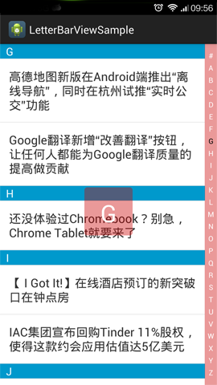

## Android 字母导航条 (Android Letter Bar View)

实现了类似于 Android 手机中字母导航功能， 支持导航条自定义字母集。

##如何使用

请参照 `\LetterBarViewSample` 中的例子来使用。

#####1. 添加 `LetterBarView` 到你想使用的布局中。

注意：若要在 layout 中使用 LetterBarView 自定义的 attr(在例子中定义为 `letterBar`)，则必须在 layout 开头添加  `xmlns:letterBar="http://schemas.android.com/apk/res/[你的包名]`。

下面所示的代码就是完整的示例。

		<FrameLayout xmlns:android="http://schemas.android.com/apk/res/android"
			xmlns:letterBar="http://schemas.android.com/apk/res/com.lwz.letterbarview.sample" // 注意这个地方
		    xmlns:tools="http://schemas.android.com/tools"
		    android:layout_width="match_parent"
		    android:layout_height="match_parent"
		    android:background="@android:color/white" >
		
		    <ListView
		        android:id="@+id/listview"
		        android:layout_width="match_parent"
		        android:layout_height="wrap_content"
		        android:cacheColorHint="#00000000"
		        android:paddingRight="20dp" />
		
		    <com.lwz.letterbarview.lib.LetterBarView
		        android:id="@+id/letter_bar"
		        android:layout_width="match_parent"
		        android:layout_height="match_parent"
		        android:layout_gravity="right"
		        android:paddingBottom="10dp"
		        android:paddingTop="10dp"
		        letterBar:lbOverlayTextSize="40sp"
		        letterBar:lbOverlayTextColor="#FFF"
		        letterBar:lbOverlayBackground="@drawable/bg_overlay"
		        letterBar:lbLetterBarTextColor="@color/selector_letterbar_text"
		        letterBar:lbLetterBarBackground="@drawable/bg_letterbar" />
		</FrameLayout>

若您对使用 自定义的 attr 不明白，可以参照 

- [Android Custom UI With custom Attributes](http://stackoverflow.com/questions/7608464/android-custom-ui-with-custom-attributes "Android - custom UI with custom attributes") - `stackoverflow.com`
- [Define Custom Attributes](http://developer.android.com/training/custom-views/create-view.html#customattr) - `developer.android.com`

#####2. 自定义的属性 attr
- lbLetterBarBackground - 导航条的背景 应该使用 图片选择器，可以参照 [Selector requires drawable attribute](http://stackoverflow.com/questions/9997943/selector-requires-drawable-attribute) or [drawable-resource](http://developer.android.com/guide/topics/resources/drawable-resource.html#StateList) 
- lbLetterBarTextColor - 导航条的字母颜色 应该使用颜色选择器，可以参照 [Android selector & text color](http://stackoverflow.com/questions/1219312/android-selector-text-color/3565624#3565624) or [color list resource](http://developer.android.com/guide/topics/resources/color-list-resource.html)
- lbOverlayBackground - 选中字母弹出层的背景
- lbOverlayTextColor - 选中字母弹出层字母的颜色
- lbOverlayTextSize - 选中字母弹出层字母的大小

#####3. 在代码中使用

就像你使用其他 View 一样简单

	LetterBarView letterBar = (LetterBarView) findViewById(R.id.letter_bar);
	letterBar.setOnLetterSelectListener(new OnLetterSelectListener() {
		
		@Override
		public void onLetterSelect(String s) {
			// 用户选中字母后的回调
			// TODO
		}
	});

##开源证书 MIT

	Copyright 2014 Liu wenzhu

	Permission is hereby granted, free of charge, to any person obtaining a copy
	of this software and associated documentation files (the "Software"), to deal
	in the Software without restriction, including without limitation the rights
	to use, copy, modify, merge, publish, distribute, sublicense, and/or sell
	copies of the Software, and to permit persons to whom the Software is
	furnished to do so, subject to the following conditions:
	
	The above copyright notice and this permission notice shall be included in
	all copies or substantial portions of the Software.
	
	THE SOFTWARE IS PROVIDED "AS IS", WITHOUT WARRANTY OF ANY KIND, EXPRESS OR
	IMPLIED, INCLUDING BUT NOT LIMITED TO THE WARRANTIES OF MERCHANTABILITY,
	FITNESS FOR A PARTICULAR PURPOSE AND NONINFRINGEMENT. IN NO EVENT SHALL THE
	AUTHORS OR COPYRIGHT HOLDERS BE LIABLE FOR ANY CLAIM, DAMAGES OR OTHER
	LIABILITY, WHETHER IN AN ACTION OF CONTRACT, TORT OR OTHERWISE, ARISING FROM,
	OUT OF OR IN CONNECTION WITH THE SOFTWARE OR THE USE OR OTHER DEALINGS IN
	THE SOFTWARE.

	

